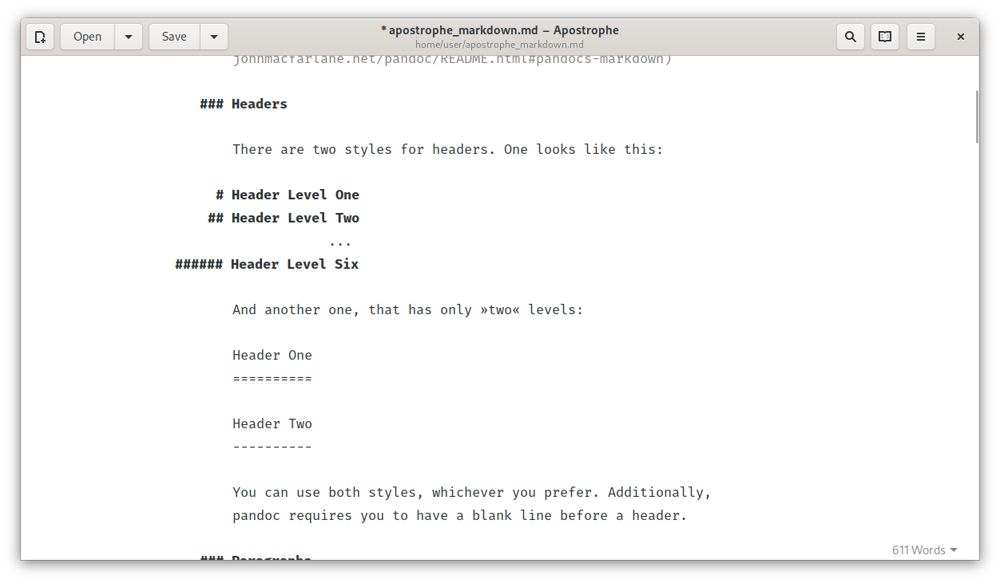

[](https://stopthemingmy.app)

# Apostrophe



## About

Apostrophe is a [GTK+](https://www.gtk.org) based distraction free Markdown editor, mainly developed by Wolf Vollprecht and Manuel Genovés. It uses pandoc as back-end for parsing Markdown and offers a very clean and sleek user interface.

## Install

<a href='https://flathub.org/apps/details/org.gnome.gitlab.somas.Apostrophe'></a>

Also several unofficial builds are available:

* Nix(OS): [`pkgs.apostrophe`](https://github.com/NixOS/nixpkgs/blob/master/pkgs/applications/editors/apostrophe/default.nix)
* Arch Linux (AUR)
* [Fedora](https://src.fedoraproject.org/rpms/apostrophe): `sudo dnf install apostrophe`

## Translation

If you want to help translating the project, please join us at [Poeditor](https://poeditor.com/join/project/gxVzFyXb2x).
Any help is appreciated!

## Building

### Building using GNOME Builder

GNOME Builder offers the easiest method to build Apostrophe. Just follow [this guide](https://wiki.gnome.org/Newcomers/BuildProject) and you'll be up and running in a minute.

### Building from Git

To build Apostrophe from source you need to have the following dependencies installed:

- Build system: `meson ninja-build`
- Pandoc, the program used to convert Markdown to basically anything else: `pandoc`
- GTK3 and GLib development packages: `libgtk-3-dev libglib2.0-dev`
- Rendering the preview panel: `libwebkit2gtk`
- Spell checking libraries: `gobject-introspection libgirepository1.0-dev gir1.2-gspell1 gettext`
- Python dependencies: `python3 python3-regex python3-setuptools python3-levenshtein python3-enchant python3-gi python3-cairo python3-pypandoc`
- *optional:* AppStream utility: `appstream-util`
- *optional:* pdftex module: `texlive texlive-latex-extra`
- *optional:* formula preview: `libjs-mathjax`

Depending on your setup you may need to install these schemas before building:

```bash
$ sudo cp data/org.gnome.gitlab.somas.Apostrophe.gschema.xml /usr/share/glib-2.0/schemas/org.gnome.gitlab.somas.Apostrophe.gschema.xml
$ sudo glib-compile-schemas /usr/share/glib-2.0/schemas
```

Once all dependencies are installed you can build Apostrophe using the following commands:

```bash
$ git clone https://gitlab.gnome.org/somas/apostrophe/
$ cd apostrophe
$ meson builddir --prefix=/usr
$ sudo ninja -C builddir install
```


### Building a flatpak package

It's also possible to build, run and debug a flatpak package. All you need is to setup [flatpak-builder](https://docs.flatpak.org/en/latest/first-build.html) and run the following commands:

```bash
$ cd build-aux/flatpak
$ flatpak-builder --force-clean --install --user _build org.gnome.gitlab.somas.Apostrophe.json
```
